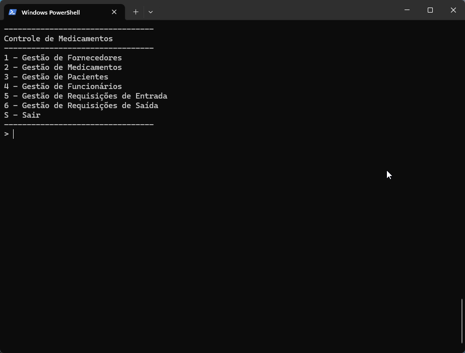

# Controle de Medicamentos



## Projeto

Desenvolvido durante o curso Backend da [Academia do Programador](https://www.academiadoprogramador.net) 2026

## Introdução

Este projeto é um sistema de controle de medicamentos desenvolvido em C#. O objetivo é facilitar o cadastro de fornecedores, medicamentos, pacientes e funcionários, além de controlar a entrada e a saída de medicamentos do estoque.

O sistema foi desenvolvido em aplicação Console e utiliza arquivos JSON para salvar os dados, permitindo que as informações sejam mantidas mesmo após fechar o programa.

## Funcionalidades

O sistema possui as seguintes funcionalidades:

- Cadastro, edição, visualização e exclusão de fornecedores.
- Cadastro, edição, visualização e exclusão de medicamentos.
- Cadastro, edição, visualização e exclusão de pacientes.
- Cadastro, edição, visualização e exclusão de funcionários.
- Registro de requisições de entrada de medicamentos no estoque.
- Registro de requisições de saída de medicamentos para pacientes.
- Controle automático da quantidade de medicamentos em estoque.
- Validação dos dados informados durante os cadastros.
- Persistência dos dados em arquivos JSON.

## Como utilizar

1. Clone o repositório ou baixe o código fonte.
2. Abra o terminal ou o prompt de comando e navegue até a pasta raiz
3. Utilize o comando abaixo para restaurar as dependências do projeto.

   ```bash
   dotnet restore
   ```

4. Para executar o projeto compilando em tempo real

   ```bash
   dotnet run --project ControleDeMedicamentos.ConsoleApp
   ```

## Requisitos

- .NET 10.0 SDK
